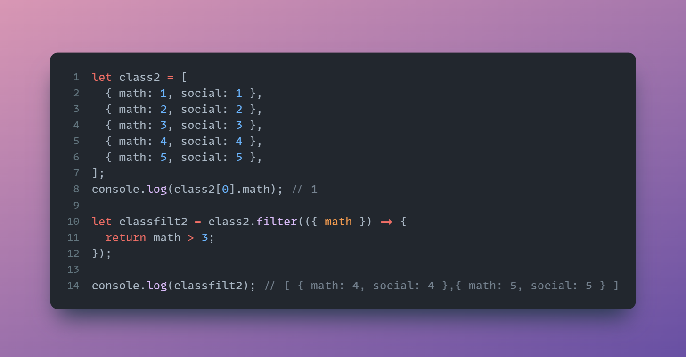

Today #Day77 of #100DaysOfCode, I am coding and explaining the 'How To Build A Weather App In JavaScript Without Needing A Server' project taught by \[Web Dev Simplified\]

# Transforming the API Data

Processing the data that is returning from API URL is an imperative step,

use .then and return the current, daily and hourly data,

```javascript
.then(({data})=>{
        return {
            current:parseCurrentWeather(data),
            daily:parseDailyWeather(data),
            hourly:parseHourlyWeather(data)
        }
})
```

now define the parse current weather function,

and return the object data that would end up in the header section of the weatherAPI project as defined in the HTML file,

these are the different variables we need from the API data,

```javascript
return{
        currentTemp,
        hightemp:,
        lowTemp:,
        highFeelslike: ,
        lowFeelslike: ,
        windSpeed ,
        precip,
        iconCode
    }
```

After defining what we need to return now destructure the data of current weather,

To get them from the API data, we a concept called object destructuring,

The left-side keys should match the right-side object,

```javascript
const {temperature: currentTemp,windspeed:windSpeed,weathercode:iconCode} = current_weather
```

then destructure the data of daily obj,

```javascript
  const {
    temperature_2m_max: [maxTemp],
    temperature_2m_min: [minTemp],
    apparent_temperature_max: [maxFeelslike],
    apparent_temperature_min: [minFeelslike],
    precipitation_sum: [precip]
  } = daily
```

The below code link exercises created by me will clear any doubts if you have on destructuring when the right side obj has an array as the value for a key.

## Code: destructurearrayfrmobj [\[click\]](https://www.sololearn.com/compiler-playground/W0r7AV63QR3B)

Now, assign the destructed data values to the returning variables,

Use Math.round() method to roundoff,

```javascript
  return {
    currentTemp: Math.round(currentTemp),
    hightemp: Math.round(maxTemp),
    lowTemp: Math.round(minTemp),
    highFeelsLike: Math.round(maxFeelslike),
    lowFeelsLike: Math.round(minFeelslike),
    windSpeed: Math.round(windSpeed),
    precip: Math.round(precip*100)/100,
    iconCode,
  };
```

Now, parse the data for the daily weather function,

pass the daily obj in data obj as an argument,

we need the time array from the daily obj,

```javascript
function parseDailyWeather({daily}){
  return daily.time
}
```

the above code will return only the time array but we need other array values for each index of the time array,

Then, map over the time value array inside the daily object,

```javascript
return daily.time.map((time, index) => {
  });
```

I have explained the difference between forEach() method and map() method in the link below.

## Code: foreach&map [\[click\]](https://www.sololearn.com/compiler-playground/Ws3xgJfKtq4o)

Now, the index value of the time array will be sent inside and define the return values that you want from other arrays for this index,

API returns time in seconds but JS expects in ms, 1 sec = 1000ms,

map method expects a return statement

```javascript
return {
      timestamp: time *1000,
      iconcode: daily.weathercode[index],
      maxTemp: Math.round(daily.temperature_2m_max[index]),
}
```

Lastly, parse the data for the hourly weather,

pass the hourly argument and current weather as argumet,

the reason we are passing current weather object because we need to access the current time,

```javascript
function parseHourlyWeather({hourly,current_weather}){
  return hourly.time.map((time,index)=>{
    return{
      timestamp: time *1000,
      iconcode: hourly.weathercode[index],
      temp: Math.round(hourly.temperature_2m[index]),
      feelslike: Math.round(hourly.apparent_temperature[index]),
      windSpeed: Math.round(hourly.windspeed_10m[index]),
      precip: Math.round(hourly.precipitation[index]*100)/100,
    }
  })
}
```

Now, define to start the hourly at the current time,

use filter() method to

```javascript
.filter(({ timestamp }) => timestamp >= current_weather.time * 1000);
```

I have explained how to filter an array containing objects using the property of this object,

kyle passed `{ timestamp }` as an implicit argument to filter method which made me think for hours,

You can see the arguments in the function `parseHourlyWeather({ hourly, current_weather })` definition while calling it we sent `parseDailyWeather(data)` data argument, but the data object contains current\_weather obj, daily obj, hourly obj. Hence Kyle passed only the required objects in exclusive functions.

you can explicitly write the code to understand,

```javascript
.filter((x) => x.timestamp >= current_weather.time * 1000);
```

I explained the filter method with also the explicit way and implicit way.

Below Image shows the filter() method working,



## Code: filterarray[\[click\]](https://www.sololearn.com/compiler-playground/WV3byYw3917S)

# Conclusion

I completed Transforming the API Data of the weather API project.

Explained destructure array from obj,

Explained foreach & map methods

Explained filter array method

# Code

1. Code
    
    
    
    preview
    
    

# Source: Code with WebDevSimplified \[[click](https://youtu.be/w0VEOghdMpQ)\]

# Author: Dheeraj.y

# Connect with me:

* [My Twitter](https://twitter.com/yssdheeraj)
    
* [My LinkedIn](https://www.linkedin.com/in/dheerajy1/)
    
* [My GitHub](https://github.com/dheerajy1)
    
* [My Hashnode](https://dheerajy1.hashnode.dev/)